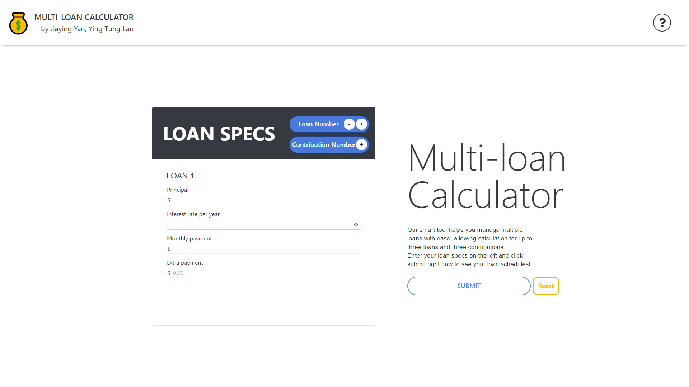
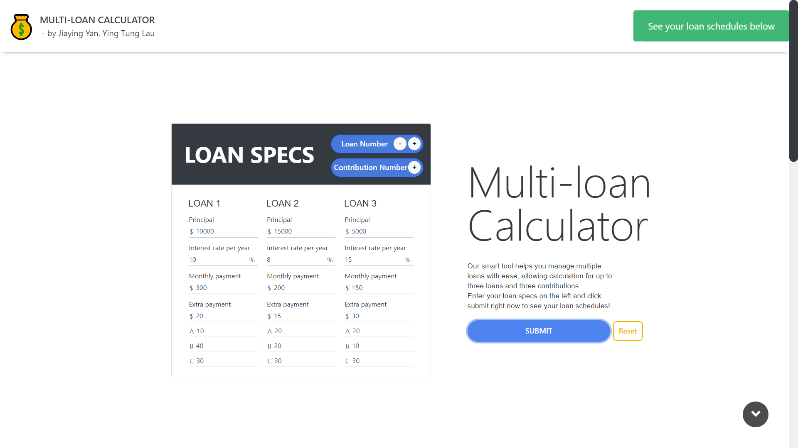
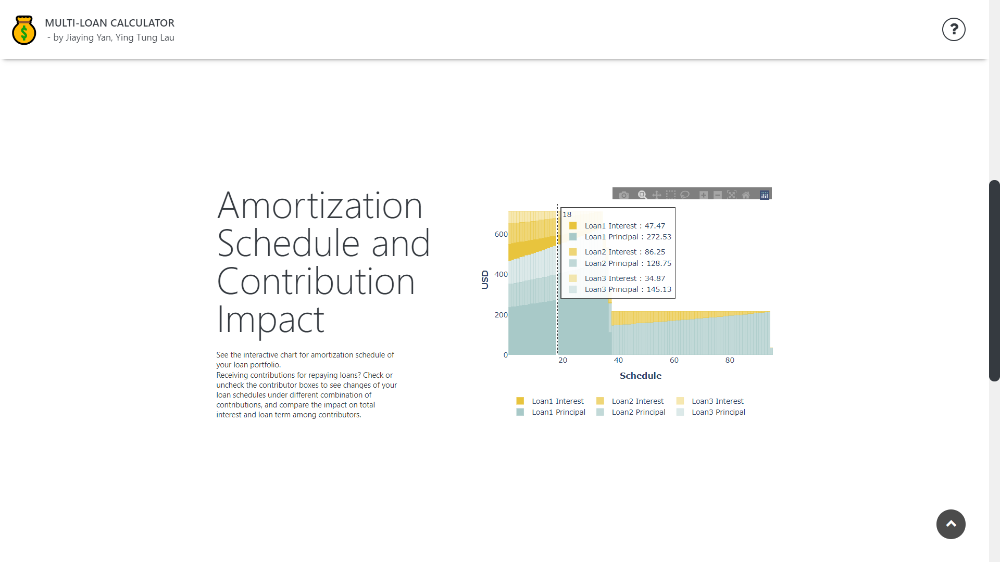
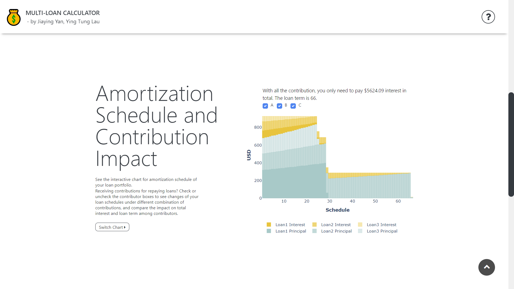
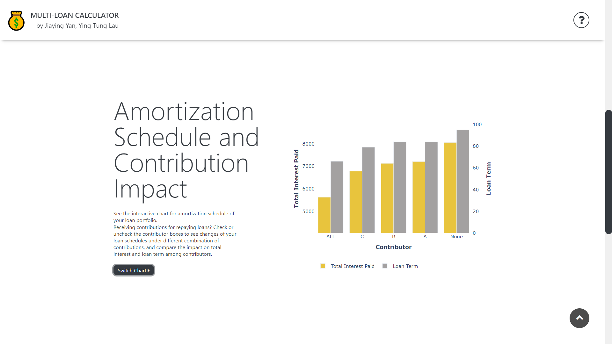
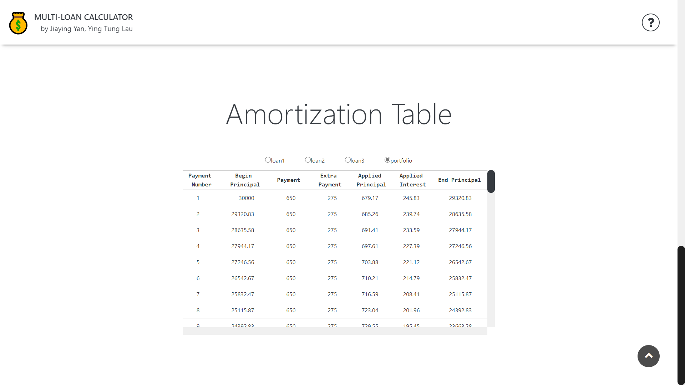

# MULTI-LOAN CALCULATOR  [](https://opensource.org/licenses/Apache-2.0) 



Need a tool for managing multiple loans with ease?  Try our app! 

Enter and submit your loan specs, and see:

:crown: nice visualizations of loan portfolio and individual loan amortization schedule

:sparkles: metrics for impact of any contributor to the loan

## Table of Contents

- [About this app](#about-this-app)
  - [Get started](#get-started)
  - [Interactive Amortization Chart](#interactive-amortization-chart) 
  - [Contribution Impact Chart](#contribution-impact-chart)
  - [Amortization Table](#amortization-table)
- [Run this app locally](#run-this-app-locally)
- [Built with](#built-with)
- [License](#license)
- [Authors](#authors)

## About this app

### Get Started

To use our tool, you first need to submit valid loan specs, i.e. **principal, annual interest rate, minimum monthly payment, and extra payment (optional)**. Our app will automatically checks the input and displays alert for any invalid loan specs. When you see the green success alert after submitting, your loan schedules are ready! :tada:



- The `increment` and `decrement` buttons in the loan specs card header let you adjust the number of loans or contributions easily. The input portfolio can have up to three loans  and you can add up to three contributions for each loan.
- You can change and resubmit loan specs at any time. Click `reset` if you want to clear all the input and enter a new loan portfolio.
- The `help` button on the upper right hand corner links you to a webpage with information on loan amortization terminology.
- Navigation is made easy with a few `anchor` buttons on the page.


### Interactive Amortization Chart

The interactive amortization chart displays amortization schedule of your loan portfolio. 

- When you `hover` over the chart, there will be a text box displaying the amount of interest and principal applied for each loan in the portfolio.

  

- If you are receiving contributions for repaying loans, there will be `checkboxes` above the chart that let you compare loan schedules under different combination of contributions.  The accompanying `text` will show the impact of the checked or unchecked contributors on the loan portfolio's total interest and loan term.

  

### Contribution Impact Chart

When there is contribution,  the app will generate an additional chart that shows the loan portfolio's total interest and loan term with all of the contributions, with individual contribution, and with none of the contributions.

- You can switch between the amortization chart and the contribution impact chart by clicking the `switch chart` button. 



### **Amortization Table** 

Besides the charts, our app shows the amortization tables for your loan portfolio as well as individual loans. You can switch among tables with ease by selecting `radio button` above the table.



## Run this app locally

To get started, clone this repo:


```
git clone https://github.com/sharonytlau/dash-loan-calculator.git
cd dash-loan-calculator
```

Install the dependencies:

```
pip install -r requirements.txt
```

Run the app:

```
python app.py
```

and visit http://127.0.0.1:8050/ in your web browser. 

Now, try it! :rocket:

## Built with

- [Dash](https://github.com/plotly/dash) - Python framework for web applications
- [Dash Bootstrap Components](https://github.com/facultyai/dash-bootstrap-components) - Layout engine, default styles and high-level components based on Bootstrap

## License

Our app is made available under the  [Apache 2.0 License](https://github.com/sharonytlau/moodquote/blob/master/LICENSE).

## Authors

- **Jiaying Yan** – jiayingyan@brandeis.edu
- **Ying Tung Lau** – [sharonytlau](https://github.com/sharonytlau) – sharonlau@brandeis.edu

Feel free to contact us about your user experience. Your precious feedbacks will help us improve our application! :blush:

